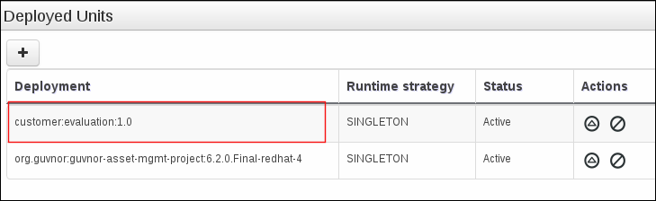
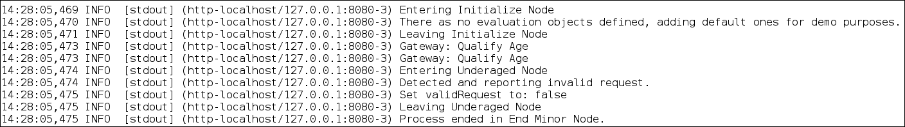
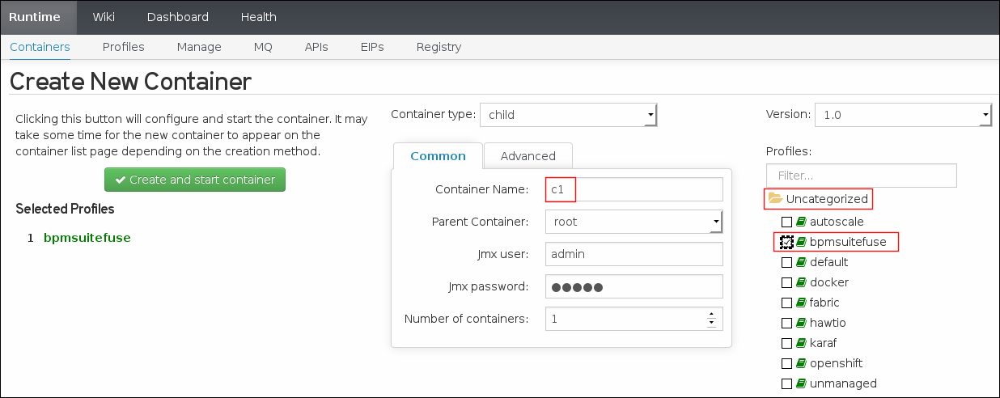

= JBoss BPM Suite & JBoss Fuse Integration Demo

:data-uri:
:toc: manual
:toc-placement: preamble
:numbered:

Demos focused on integration scenarios between JBoss BPM Suite and JBoss Fuse.

== Overview

=== Features
The following integration use cases are currently demonstrated in this project:

. Invoke a BPM process from a fuse camel route.
.. Includes the following BPMN2:
+
image::images/customer-evaluation.png[]
+
.. Also includes the following Camel route:
+
image::images/camelroute.png[]


=== Lab Deployment Options
There are two options available for using this demo:

. <<local>>
. <<docker>>

[[local]]
== Local Install

=== Download and Install

. Clone this project to local workstation:
+
-----
git clone https://github.com/jbride/brms-fuse-integration-demo.git
-----
+
[NOTE]
If running on Windows, it is recommended the project be extracted to a location near the root drive path due to limitations of length of file/path names.
+
Once cloned, a new directory called `brms-fuse-integration-demo` should appear in your local filesystem.
For the purposes of this tutorial, this directory will be referred to as `$PROJECT_HOME` .

. Download the following from the JBoss Customer Portal
* JBoss EAP (jboss-eap-6.4.0.zip)
* BPM Suite (jboss-bpmsuite-6.1.0.GA-installer.jar)
* Fuse (jboss-fuse-full-6.1.1.redhat-412.zip)
. Move downloads to $PROJECT_HOME/installs directory
. Ensure all files are executable:
.. cd $PROJECT_HOME
.. Execute:  `chmod -R 755 installs`
. Execute:  init script

.. `./init.sh`

=== Deploy BPM *customer-evaluation* project
Your BPM environment comes seeded with a demo organization called: `Sales` and a git repository called: `customer`.

In this section, let's build and deploy the KIE project included in this `customer` repository.

. Start the JBoss BPM Suite server
.. cd  $PROJECT_HOME/target/jboss-eap-6.4
.. execute:  ./bin/standalone.sh
. log into the `BPM Console` at `http://localhost:8080/business-central`
+
Use the following credentials to authenticate:  (u:bpmsAdmin/p:bpmsuite1!).
. Navigate to `Authoring -> Project Authoring`
+
You'll notice that in the `customer` repository is an existing project called: `customer-evaluation`.
+
image::images/builddeploy.png[]
. Click `Open Project Editor`
. In the tob toolbar of the `Project` panel, select `Build and Deploy` from the `Build` dropdown.
. In the top toolbar of the `BPM Console`, select `Deploy -> Process Deployments`
+
You should see a new Deployment Unit of: `customer:evaluation:1.0`
+


=== Execute *simpleRoute* project at command line
In this section, the camel based `simpleRoute` project will be executed at the command line.

Within the camel route, the class `com.jboss.examples.RestClientSimple` will be invoked.
This class utilizes Apache HTTP commons libraries to invoke the RESTFul API of the remote BPM Suite 6 Execution Server.
A single instnace of the `customer.evaluation` BPMN2 process is started.

. cd $PROJECT_HOME/projects/brms-fuse-integration/simpleRoute
. mvn camel:run
. In the BPM Suite 6 log file, there should be new messages similar to the following:
+


=== Execute *simpleRoute* project in JBoss Fuse

==== Start Fuse server and Fabric
. cd target/jboss-fuse-6.1.1.redhat-412/
. ./bin/fuse
. Create a new Fuse fabric (which consists of a single Fabric Server, by default).
+
Enter the following command in the JBoss Fuse console:
+
-----
fabric:create --wait-for-provisioning
-----
. Tail the fuse server log file
+
Enter the following command in the JBoss Fuse console:
+
-----
log:tail
-----

==== Deploy *simpleRoute* artifact to Fuse
. Add fabric server passwords for Maven Plugin to your `~/.m2/settings.xml` file
+
This is required so that the maven plugin can login to fabric.
+
-----
```
<!-- Server login to upload to fabric. -->
<servers>
  <server>
    <id>fabric8.upload.repo</id>
    <username>admin</username>
    <password>admin</password>
  </server>
</servers>
```
-----
. Deploy `simpleRoute` project
.. cd projects/brms-fuse-integration/simpleRoute:
.. execute:
+
-----
mvn fabric8:deploy
-----

==== Create Fuse container using *bpmsuitefuse* profile
. Login to Fuse management console at:  http://localhost:8181
+
Use the following credentials:  (u:admin/p:admin).

. Create container name c1 and add bpmsuitefuse profile (see screenshot below)
.. In the top toolbar of the `Fuse Management Console`, navigate to: `Runtime -> Containers`
.. Click the `Create` button at the right side of the panel:
+
image::images/createbutton.png[]
.. The `Create New Container` panel appears.
+

.. As the value of the *Container Name* text box, enter:  `c1`
.. In the `Profiles` section, expand the `Uncategorized` folder and select `bpmsuitefuse`
.. Click the green `Create and start container` button

==== Trigger camel route
.. cd $PROJECT_HOME
.. Ensure you are tailing both the BPM Suite 6 and JBoss Fuse log files
.. execute:
+
`cp support/data/message.xml target/jboss-fuse-6.1.1.redhat-412/instances/c1/src/data`
.. Similar to when the *simpleroute* project was executed from the command line, the following should appear in the BPM Suite 6 log file:
+


[[docker]]
== Docker install

The following steps can be used to configure and run the demo in a docker container

1. [Download and unzip.](https://github.com/jbossdemocentral/brms-fuse-integration-demo/archive/master.zip).

2. Add products to installs directory.

3. Copy contents of support/docker directory to the project root.

4. Build demo image

	```
	docker build -t jbossdemocentral/brms-fuse-integration-demo .
	```

5. Start demo container

	```
	docker run --it -p 8080:8080 -p 9990:9990 -p 8181:8181 jbossdemocentral/brms-fuse-integration-demo
	```

6. Login, build and deploy JBoss BPM Suite process project at http://<DOCKER_HOST>:8080/business-central (u:erics/p:bpmsuite1!).

7. Login to Fuse management console at:  http://<DOCKER_HOST>:8181    (u:admin/p:admin).

8. Navigate to Terminal tab and create fabric

     ```
     fabric:create --wait-for-provisioning
     ```

9. Within the running container, deploy simple route from /opt/jboss/projects/brms-fuse-integration/simpleRoute:

     ```
     mvn fabric8:deploy
     ```

	1. When prompted to update the settings.xml file, select **y** and enter admin/admin for the user name and password
	2. If the deployment fails due to "Access Denied", rerun command. This is a known [issue](https://github.com/fabric8io/fabric8/issues/1404)

10. Create container name c1 and add bpmsuitefuse profile (see screenshot below)

11. Trigger camel route by placing /opt/jboss/support/data/message.xml file into /opt/jboss/fuse/jboss-fuse-6.1.0.redhat-379/instances/c1/src/data folder (see screenshot below)

12. Enjoy the demo!

Additional information can be found in the jbossdemocentral docker [developer repository](https://github.com/jbossdemocentral/docker-developer)


Coming soon
-----------

  * call a fuse end point from a BPM process.

  * embed a rule decision into a fuse camel route.

  * embed a process into a fuse camel route.


Supporting Articles
-------------------
[The Most Popular Way to Get Started Integrating BPM with Apache Camel](http://www.schabell.org/2014/09/most-popular-way-get-started-integrating-bpm-apache-camel.html)

[Enhancing your JBoss Integration with JBoss BRMS] (http://www.schabell.org/2013/08/enhancing-jboss-integration-jboss-fuse-brms.html)


Released versions
-----------------
See the tagged releases for the following versions of the product:

- v2.3 is JBoss BPM Suite 6.0.3 installer, JBoss Fuse Full 6.1.0 and optional docker installation.

- v2.2 moved to JBoss Demo Central, with updated windows init.bat support.

- v2.1 is JBoss BPM Suite 6.0.3 installer, JBoss Fuse Full 6.1.0, with route and process

- v2.0 is JBoss BPM Suite 6.0.2 deployable, running on JBoss EAP 6.1.1, and JBoss Fuse Full 6.1.0, with route and process integration project deployed.

- v1.0 is BRMS 5.3.1 deployable, running on JBoss EAP 6.1.0, and JBoss Fuse Full 6.0.0.


[![Video Demo Run] (https://raw.githubusercontent.com/jbossdemocentral/brms-fuse-integration-demo/master/docs/demo-images/video-demo-run.png)](http://vimeo.com/ericschabell/bpmsuite-fuse-integraiton-demo-run)

![BPM Suite BAM] (https://raw.githubusercontent.com/jbossdemocentral/brms-fuse-integration-demo/master/docs/demo-images/bam-dashboard.png)
